Analyzing Manchester United Goals: A Comparison of Generalized Linear
Models for Count Data
================
Wayne Chilionje

# Comparative Analysis of Count Models and Clustering Techniques Using Manchester United 2023/24 Passing Data

## Introduction

This analysis explores Manchester United’s performance in the 2023/24
season, focusing on passing statistics, goals scored (GF), goals against
(GA), expected goals (xG), and other advanced metrics. We apply count
models (Log-linear, Poisson, Quasi-Poisson, Negative Binomial) and
clustering techniques (Linear Mixed-Effects Models, Hierarchical
Clustering) to understand the relationships between variables and
identify patterns in the data. All this will be done using Manchester
United Passing Data of their 23/24 season in the Premier League, which
is sourced from fbref.

[Manchester United 2023-2024 Passing Match Logs - Premier
League](https://fbref.com/en/squads/19538871/2023-2024/matchlogs/c9/passing/Manchester-United-Match-Logs-Premier-League)

The variables in question include:

1.  **Round**: The round of the competition in which the match was
    played.
2.  **Day**: The day of the week when the match took place.
3.  **Venue**: The stadium or location where the match was held.
4.  **Result**: The outcome of the match.
5.  **GF**: Goals For; the number of goals scored by the team.
6.  **GA**: Goals Against; the number of goals conceded by the team.
7.  **Opponent**: The opposing team in the match.
8.  **Cmp**: Passes Completed; the number of successful passes made by
    the team.
9.  **Att**: Passes Attempted; the total number of passes attempted by
    the team.
10. **Cmp%**: Pass Completion Percentage; the ratio of completed passes
    to attempted passes.
11. **TotDist**: Total Distance; the total distance covered by the team
    during the match.
12. **PrgDist**: Progressive Distance; the total distance covered by the
    team in actions that move the ball towards the opponent’s goal.
13. **Ast**: Assists; the number of assists by players on the team.
14. **xAG**: Expected Assists (Goals); a metric estimating the number of
    assists a player or team should have based on the quality of the
    pass.
15. **xA**: Expected Assists; similar to xAG, focusing on the expected
    goal value of passes made.
16. **KP**: Key Passes; passes that directly lead to a shot on goal.
17. **Final_3rd_passes**: Passes completed in the final third of the
    field, indicating attacking involvement.
18. **PPA**: Passes into the Penalty Area; the number of passes played
    into the opponent’s penalty area.
19. **CrsPA**: Crosses into the Penalty Area; the number of crosses
    delivered into the opponent’s penalty area.
20. **PrgP**: Progressive Passes; passes that significantly advance the
    ball towards the opponent’s goal.
21. **xG**: Expected Goals; a metric that estimates the likelihood of a
    shot resulting in a goal. It provides a measure of the quality of
    scoring chances created by a team or player.

## Data Loading and Preparation

Here, we simply want read the dataset and ensure that the data is clean
and ready for analysis.

``` r
# Loading our data
# Loading required libraries
library(dplyr) # for data manipulation
```

    ## 
    ## Attaching package: 'dplyr'

    ## The following objects are masked from 'package:stats':
    ## 
    ##     filter, lag

    ## The following objects are masked from 'package:base':
    ## 
    ##     intersect, setdiff, setequal, union

``` r
library(ggplot2) # for visualization
library(MASS) # for Negative Binomial model
```

    ## 
    ## Attaching package: 'MASS'

    ## The following object is masked from 'package:dplyr':
    ## 
    ##     select

``` r
library(lme4) # for Linear Mixed-Effects Models
```

    ## Loading required package: Matrix

``` r
library(dendextend) # for hierarchical clustering
```

    ## 
    ## ---------------------
    ## Welcome to dendextend version 1.19.1
    ## Type citation('dendextend') for how to cite the package.
    ## 
    ## Type browseVignettes(package = 'dendextend') for the package vignette.
    ## The github page is: https://github.com/talgalili/dendextend/
    ## 
    ## Suggestions and bug-reports can be submitted at: https://github.com/talgalili/dendextend/issues
    ## You may ask questions at stackoverflow, use the r and dendextend tags: 
    ##   https://stackoverflow.com/questions/tagged/dendextend
    ## 
    ##  To suppress this message use:  suppressPackageStartupMessages(library(dendextend))
    ## ---------------------

    ## 
    ## Attaching package: 'dendextend'

    ## The following object is masked from 'package:stats':
    ## 
    ##     cutree

``` r
library(readxl) # for reading the excel data
mufc_data <- read_excel("C:/Users/Admin/Downloads/MUFC 23_24 Passing Data Cleaned.xlsx")
head(mufc_data)
```

    ## # A tibble: 6 × 22
    ##   Date                Round  Day   Venue Result    GF    GA Opponent   Cmp   Att
    ##   <dttm>              <chr>  <chr> <chr> <chr>  <dbl> <dbl> <chr>    <dbl> <dbl>
    ## 1 2023-08-14 00:00:00 Match… Mon   Home  W          1     0 Wolves     402   502
    ## 2 2023-08-19 00:00:00 Match… Sat   Away  L          0     2 Tottenh…   360   443
    ## 3 2023-08-26 00:00:00 Match… Sat   Home  W          3     2 Nott'ha…   567   681
    ## 4 2023-09-03 00:00:00 Match… Sun   Away  L          1     3 Arsenal    406   481
    ## 5 2023-09-16 00:00:00 Match… Sat   Home  L          1     3 Brighton   445   539
    ## 6 2023-09-23 00:00:00 Match… Sat   Away  W          1     0 Burnley    342   437
    ## # ℹ 12 more variables: `Cmp%` <dbl>, TotDist <dbl>, PrgDist <dbl>, Ast <dbl>,
    ## #   xAG <dbl>, xA <dbl>, KP <dbl>, Final_3rd_passes <dbl>, PPA <dbl>,
    ## #   CrsPA <dbl>, PrgP <dbl>, xG <dbl>

``` r
str(mufc_data)
```

    ## tibble [38 × 22] (S3: tbl_df/tbl/data.frame)
    ##  $ Date            : POSIXct[1:38], format: "2023-08-14" "2023-08-19" ...
    ##  $ Round           : chr [1:38] "Matchweek 1" "Matchweek 2" "Matchweek 3" "Matchweek 4" ...
    ##  $ Day             : chr [1:38] "Mon" "Sat" "Sat" "Sun" ...
    ##  $ Venue           : chr [1:38] "Home" "Away" "Home" "Away" ...
    ##  $ Result          : chr [1:38] "W" "L" "W" "L" ...
    ##  $ GF              : num [1:38] 1 0 3 1 1 1 0 2 2 0 ...
    ##  $ GA              : num [1:38] 0 2 2 3 3 0 1 1 1 3 ...
    ##  $ Opponent        : chr [1:38] "Wolves" "Tottenham" "Nott'ham Forest" "Arsenal" ...
    ##  $ Cmp             : num [1:38] 402 360 567 406 445 342 688 528 471 335 ...
    ##  $ Att             : num [1:38] 502 443 681 481 539 437 810 633 603 429 ...
    ##  $ Cmp%            : num [1:38] 80.1 81.3 83.3 84.4 82.6 78.3 84.9 83.4 78.1 78.1 ...
    ##  $ TotDist         : num [1:38] 6421 6203 8741 6852 7627 ...
    ##  $ PrgDist         : num [1:38] 2253 2289 2639 2209 2446 ...
    ##  $ Ast             : num [1:38] 1 0 2 1 1 1 0 1 2 0 ...
    ##  $ xAG             : num [1:38] 2.2 1.9 1.9 0.8 0.8 0.9 1.1 1.2 0.5 0.9 ...
    ##  $ xA              : num [1:38] 1.7 1.4 2.1 0.6 0.7 1.3 1.4 1.2 0.6 0.5 ...
    ##  $ KP              : num [1:38] 13 19 15 8 11 10 14 18 8 7 ...
    ##  $ Final_3rd_passes: num [1:38] 32 30 59 20 43 25 61 55 42 16 ...
    ##  $ PPA             : num [1:38] 15 10 12 3 7 9 20 27 5 5 ...
    ##  $ CrsPA           : num [1:38] 1 0 0 0 1 1 2 7 1 1 ...
    ##  $ PrgP            : num [1:38] 50 48 76 22 45 25 86 66 36 22 ...
    ##  $ xG              : num [1:38] 2.2 2.1 2.8 0.9 1 1 1.3 1.4 1.1 0.9 ...

### Data Cleaning

We can see that the variables need to be formatted made into the right
format, namely `Date` , `Round` , `Day` , `Venue` , `Result` and
`Opponent` .

``` r
# Clean and convert data types
data = mufc_data
data_cleaned <- data %>%
 # Convert Date to Date type
 mutate(Date = as.Date(Date)) %>%
 # Convert categorical variables to factors
 mutate(Round = as.factor(Round),
 Day = as.factor(Day),
 Venue = as.factor(Venue),
 Result = as.factor(Result),
 Opponent = as.factor(Opponent))
# Inspect the cleaned data
str(data_cleaned)
```

    ## tibble [38 × 22] (S3: tbl_df/tbl/data.frame)
    ##  $ Date            : Date[1:38], format: "2023-08-14" "2023-08-19" ...
    ##  $ Round           : Factor w/ 38 levels "Matchweek 1",..: 1 12 23 33 34 35 36 37 38 2 ...
    ##  $ Day             : Factor w/ 6 levels "Mon","Sat","Sun",..: 1 2 2 3 2 2 2 2 2 3 ...
    ##  $ Venue           : Factor w/ 2 levels "Away","Home": 2 1 2 1 2 1 2 2 1 2 ...
    ##  $ Result          : Factor w/ 3 levels "D","L","W": 3 2 3 2 2 3 2 3 3 2 ...
    ##  $ GF              : num [1:38] 1 0 3 1 1 1 0 2 2 0 ...
    ##  $ GA              : num [1:38] 0 2 2 3 3 0 1 1 1 3 ...
    ##  $ Opponent        : Factor w/ 19 levels "Arsenal","Aston Villa",..: 19 17 15 1 5 6 8 4 16 13 ...
    ##  $ Cmp             : num [1:38] 402 360 567 406 445 342 688 528 471 335 ...
    ##  $ Att             : num [1:38] 502 443 681 481 539 437 810 633 603 429 ...
    ##  $ Cmp%            : num [1:38] 80.1 81.3 83.3 84.4 82.6 78.3 84.9 83.4 78.1 78.1 ...
    ##  $ TotDist         : num [1:38] 6421 6203 8741 6852 7627 ...
    ##  $ PrgDist         : num [1:38] 2253 2289 2639 2209 2446 ...
    ##  $ Ast             : num [1:38] 1 0 2 1 1 1 0 1 2 0 ...
    ##  $ xAG             : num [1:38] 2.2 1.9 1.9 0.8 0.8 0.9 1.1 1.2 0.5 0.9 ...
    ##  $ xA              : num [1:38] 1.7 1.4 2.1 0.6 0.7 1.3 1.4 1.2 0.6 0.5 ...
    ##  $ KP              : num [1:38] 13 19 15 8 11 10 14 18 8 7 ...
    ##  $ Final_3rd_passes: num [1:38] 32 30 59 20 43 25 61 55 42 16 ...
    ##  $ PPA             : num [1:38] 15 10 12 3 7 9 20 27 5 5 ...
    ##  $ CrsPA           : num [1:38] 1 0 0 0 1 1 2 7 1 1 ...
    ##  $ PrgP            : num [1:38] 50 48 76 22 45 25 86 66 36 22 ...
    ##  $ xG              : num [1:38] 2.2 2.1 2.8 0.9 1 1 1.3 1.4 1.1 0.9 ...

- Data cleaning is now complete. The data is ready for some EDA, which
  should give us a an quick understanding of key characteristics,
  patterns, and relationships present within the dataset.

## Exploratory Data Analysis

``` r
summary(data_cleaned)
```

    ##       Date                     Round     Day      Venue    Result       GF     
    ##  Min.   :2023-08-14   Matchweek 1 : 1   Mon: 2   Away:19   D: 6   Min.   :0.0  
    ##  1st Qu.:2023-10-30   Matchweek 10: 1   Sat:18   Home:19   L:14   1st Qu.:1.0  
    ##  Median :2023-12-28   Matchweek 11: 1   Sun:12             W:18   Median :1.0  
    ##  Mean   :2024-01-06   Matchweek 12: 1   Thu: 2                    Mean   :1.5  
    ##  3rd Qu.:2024-03-24   Matchweek 13: 1   Tue: 1                    3rd Qu.:2.0  
    ##  Max.   :2024-05-19   Matchweek 14: 1   Wed: 3                    Max.   :4.0  
    ##                       (Other)     :32                                          
    ##        GA               Opponent       Cmp             Att       
    ##  Min.   :0.000   Arsenal    : 2   Min.   :224.0   Min.   :318.0  
    ##  1st Qu.:1.000   Aston Villa: 2   1st Qu.:336.8   1st Qu.:437.0  
    ##  Median :1.500   Bournemouth: 2   Median :404.0   Median :485.0  
    ##  Mean   :1.526   Brentford  : 2   Mean   :415.4   Mean   :514.2  
    ##  3rd Qu.:2.000   Brighton   : 2   3rd Qu.:470.5   3rd Qu.:569.0  
    ##  Max.   :4.000   Burnley    : 2   Max.   :688.0   Max.   :810.0  
    ##                  (Other)    :26                                  
    ##       Cmp%          TotDist         PrgDist          Ast        
    ##  Min.   :69.80   Min.   : 4029   Min.   :1529   Min.   :0.0000  
    ##  1st Qu.:77.47   1st Qu.: 5554   1st Qu.:2086   1st Qu.:0.0000  
    ##  Median :80.40   Median : 6628   Median :2341   Median :1.0000  
    ##  Mean   :80.11   Mean   : 6855   Mean   :2401   Mean   :0.9474  
    ##  3rd Qu.:83.55   3rd Qu.: 7806   3rd Qu.:2611   3rd Qu.:1.0000  
    ##  Max.   :87.70   Max.   :11227   Max.   :3782   Max.   :3.0000  
    ##                                                                 
    ##       xAG              xA               KP        Final_3rd_passes
    ##  Min.   :0.200   Min.   :0.2000   Min.   : 3.00   Min.   :10.00   
    ##  1st Qu.:0.600   1st Qu.:0.6000   1st Qu.: 8.00   1st Qu.:20.00   
    ##  Median :0.850   Median :0.7000   Median :11.00   Median :28.50   
    ##  Mean   :1.058   Mean   :0.9105   Mean   :11.42   Mean   :31.63   
    ##  3rd Qu.:1.375   3rd Qu.:1.2750   3rd Qu.:14.75   3rd Qu.:40.25   
    ##  Max.   :2.500   Max.   :2.1000   Max.   :24.00   Max.   :72.00   
    ##                                                                   
    ##       PPA             CrsPA            PrgP             xG       
    ##  Min.   : 2.000   Min.   :0.000   Min.   :15.00   Min.   :0.200  
    ##  1st Qu.: 5.250   1st Qu.:0.000   1st Qu.:25.75   1st Qu.:0.800  
    ##  Median : 8.000   Median :1.000   Median :33.50   Median :1.150  
    ##  Mean   : 8.895   Mean   :1.316   Mean   :38.92   Mean   :1.489  
    ##  3rd Qu.:10.000   3rd Qu.:2.000   3rd Qu.:46.75   3rd Qu.:2.175  
    ##  Max.   :27.000   Max.   :7.000   Max.   :86.00   Max.   :4.100  
    ## 

### Match Data and Results

- **Matches**: Span from August 2023 to May 2024, with 19 home and 19
  away games (38 total).
- **Results**: 18 wins, 14 losses, 6 draws.

### Goals

- **Goals For (GF)**: Range from 0 to 4, average 1.5 goals per match.
- **Goals Against (GA)**: Range from 0 to 4, average 1.526 goals,
  indicating competitive matches.

### Passing Statistics

- **Completed Passes (Cmp)**: Range from 224 to 688, with an average
  completion percentage (Cmp%) of 80.11%.
- **Total Distance (TotDist)**: Ranges from 4,029 to 11,227 meters,
  reflecting variability in play style or opponent difficulty.

### Advanced Metrics

- **Expected Assists (xA)**: Range from 0.2 to 2.1.
- **Expected Goals (xG)**: Range from 0.2 to 4.1.
- **Key Passes (KP)**: Average 11.42 per game, range from 3 to 24,
  showing playmaking variability.

### Labels with High Variance

- **GF and GA**: High dispersion due to range from 0 to 4.
- **Cmp and Att**: Indicate variability in passing performance.

### Visualizations

``` r
# 1. Goals For by Round
# 1. Goals For by Round
ggplot(data_cleaned, aes(x = Round, y = GF)) +
 geom_bar(stat = "identity", fill = 'red') +
 labs(title = "Goals Against by Round", x = "Round", y = "Goals Against") +
 theme(axis.text.x = element_text(angle = 45, hjust = 1, size = 8))
```

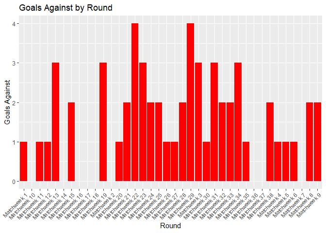<!-- -->

``` r
# 2. Goals For & Goals Against at Home
home_data <- data_cleaned %>% filter(Venue == "Home")
ggplot(home_data, aes(x = Round, y = GF, fill = "Goals For")) +
 geom_bar(stat = "identity", position = "dodge") +
 geom_bar(aes(y = GA, fill = "Goals Against"), stat = "identity", position = "dodge") +
 labs(title = "Goals For & Goals Against at Home", x = "Round", y = "Goals") +
 theme(axis.text.x = element_text(angle = 45, hjust = 1, size = 8))
```

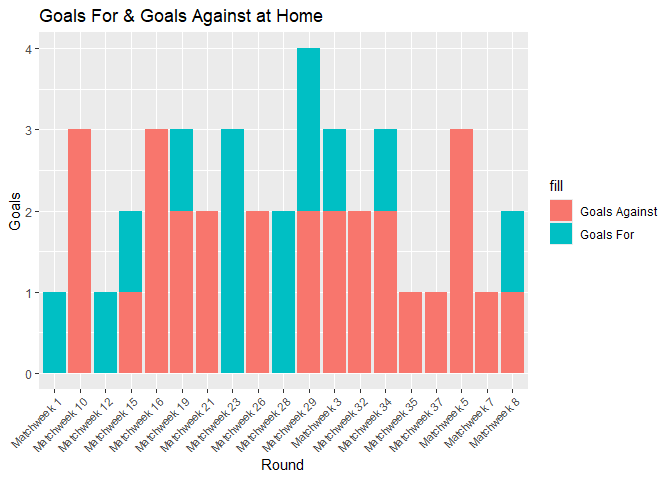<!-- -->

``` r
# 3. Goals For & Goals Against Away
away_data <- data_cleaned %>% filter(Venue == "Away")
ggplot(away_data, aes(x = Round, y = GF, fill = "Goals For")) +
 geom_bar(stat = "identity", position = "dodge") +
 geom_bar(aes(y = GA, fill = "Goals Against"), stat = "identity", position = "dodge") +
 labs(title = "Goals For & Goals Against Away", x = "Round", y = "Goals") +
 theme(axis.text.x = element_text(angle = 45, hjust = 1, size = 8))
```

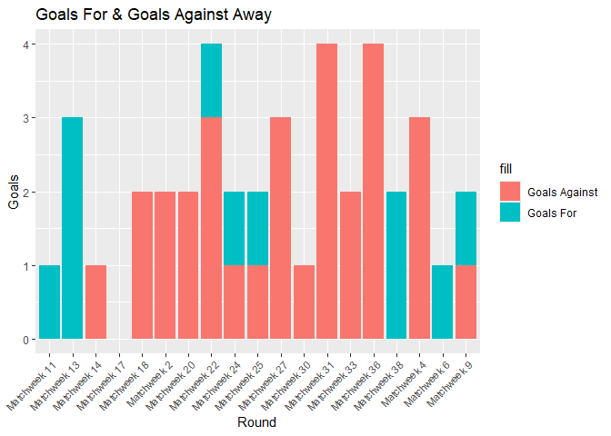<!-- -->

``` r
# 4. Expected Goals (xG) vs Round
ggplot(data_cleaned, aes(x = Round, y = xG)) +
 geom_line(group = 1, color = 'blue') +
 labs(title = "Expected Goals (xG) vs Round", x = "Round", y = "Expected Goals") +
 theme(axis.text.x = element_text(angle = 45, hjust = 1, size = 8))
```

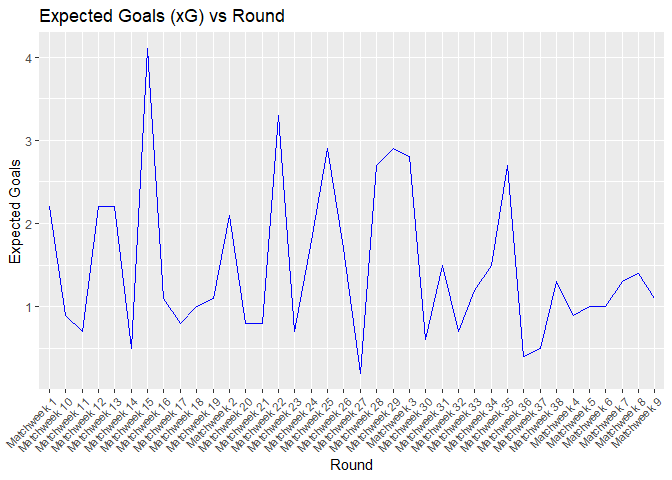<!-- -->

``` r
# 7. Top 5 Goals For vs Opponent
top5_GF <- data_cleaned %>%
 arrange(desc(GF)) %>%
 head(5)
ggplot(top5_GF, aes(x = reorder(Opponent, -GF), y = GF, fill = Opponent)) +
 geom_bar(stat = "identity") +
 labs(title = "Top 5 Goals For vs Opponent", x = "Opponent", y = "Goals For") +
 theme(axis.text.x = element_text(angle = 45, hjust = 1, size = 8))
```

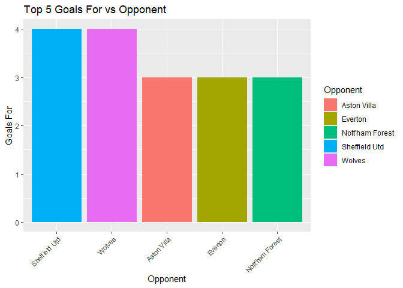<!-- -->

``` r
# 8. Top 5 Goals Against vs Opponent
top5_GA <- data_cleaned %>%
 arrange(desc(GA)) %>%
 head(5)
ggplot(top5_GA, aes(x = reorder(Opponent, -GA), y = GA, fill = Opponent)) +
 geom_bar(stat = "identity") +
 labs(title = "Top 5 Goals Against vs Opponent", x = "Opponent", y = "Goals Against") +
 theme(axis.text.x = element_text(angle = 45, hjust = 1, size = 8))
```

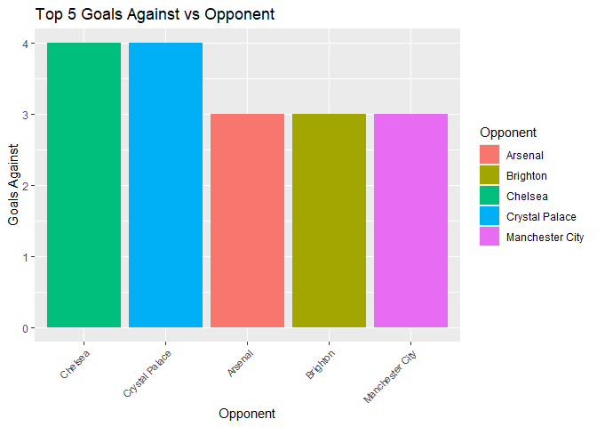<!-- -->

``` r
# 9. Top 5 and Bottom 5 Key Passes (KP) vs Opponent
top5_KP <- data_cleaned %>%
 arrange(desc(KP)) %>%
 head(5)
bottom5_KP <- data_cleaned %>%
 arrange(KP) %>%
 head(5)
top_bottom_KP <- rbind(top5_KP, bottom5_KP)
ggplot(top_bottom_KP, aes(x = reorder(Opponent, -KP), y = KP, fill = Opponent)) +
 geom_bar(stat = "identity") +
 labs(title = "Top 5 and Bottom 5 Key Passes (KP) vs Opponent", x = "Opponent", y = "Key Pas
ses") +
 theme(axis.text.x = element_text(angle = 45, hjust = 1, size = 8))
```

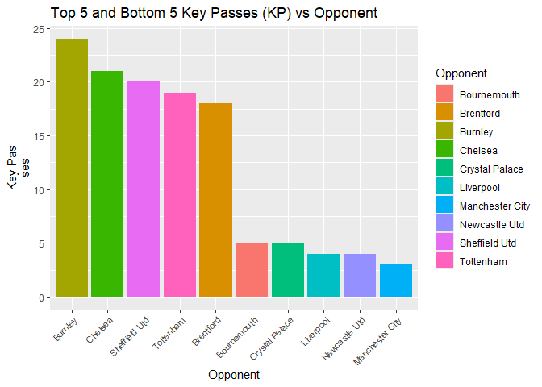<!-- -->

``` r
# 10. Result vs Venue
ggplot(data_cleaned, aes(x = Venue, fill = Result)) +
 geom_bar(position = "dodge") +
 labs(title = "Result vs Venue", x = "Venue", y = "Count")
```

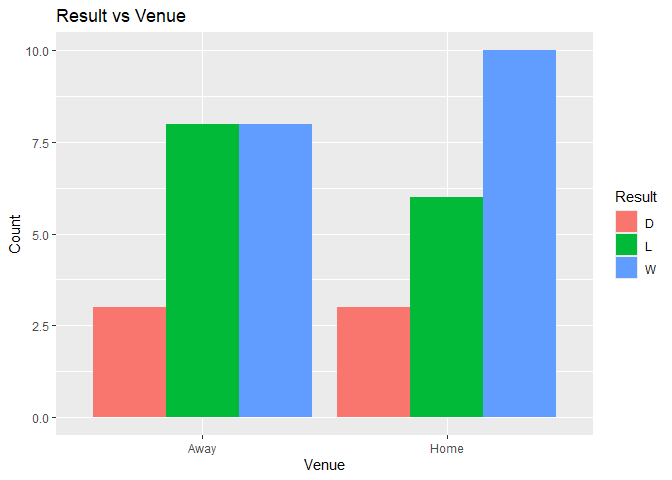<!-- -->

``` r
# 11. Result vs Day
ggplot(data_cleaned, aes(x = Day, fill = Result)) +
 geom_bar(position = "dodge") +
 labs(title = "Result vs Day", x = "Day", y = "Count")
```

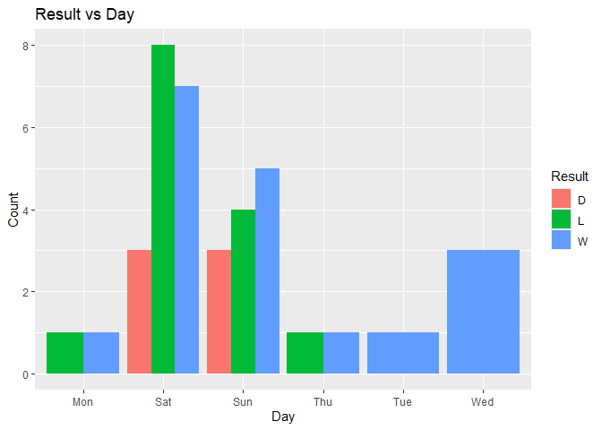<!-- -->

#### Key Insights

- **Matches**: Span from August 2023 to May 2024, with 19 home and 19
  away games (38 total).
- **Results**: 18 wins, 14 losses, 6 draws.

### Goals

- **Goals For (GF)**: Range from 0 to 4, average 1.5 goals per match.
- **Goals Against (GA)**: Range from 0 to 4, average 1.526 goals,
  indicating competitive matches.

### Passing Statistics

- **Completed Passes (Cmp)**: Range from 224 to 688, with an average
  completion percentage (Cmp%) of 80.11%.
- **Total Distance (TotDist)**: Ranges from 4,029 to 11,227 meters,
  reflecting variability in play style or opponent difficulty.

### Advanced Metrics

- **Expected Assists (xA)**: Range from 0.2 to 2.1.
- **Expected Goals (xG)**: Range from 0.2 to 4.1.
- **Key Passes (KP)**: Average 11.42 per game, range from 3 to 24,
  showing playmaking variability.

### Labels with High Variance

- **GF and GA**: High dispersion due to range from 0 to 4.
- **Cmp and Att**: Indicate variability in passing performance.

### Correlation Analysis

``` r
library(corrplot)
```

    ## corrplot 0.95 loaded

``` r
# Select numeric columns
numerical_vars <- sapply(data_cleaned, is.numeric)
numeric_data <- data_cleaned[, numerical_vars]
# Correlation matrix
correlation_matrix <- cor(numeric_data, use = "complete.obs")
correlation_matrix
```

    ##                            GF          GA          Cmp          Att       Cmp%
    ## GF                1.000000000  0.00000000 -0.007449607 -0.022906772 0.07989317
    ## GA                0.000000000  1.00000000  0.097197358  0.070454794 0.20729886
    ## Cmp              -0.007449607  0.09719736  1.000000000  0.994002614 0.81666318
    ## Att              -0.022906772  0.07045479  0.994002614  1.000000000 0.75430445
    ## Cmp%              0.079893173  0.20729886  0.816663179  0.754304454 1.00000000
    ## TotDist          -0.058396946  0.09437732  0.976378521  0.976602119 0.77105079
    ## PrgDist          -0.017696147  0.04405096  0.812996360  0.826099805 0.57871727
    ## Ast               0.838910811  0.02597911  0.015506341 -0.004855612 0.11863364
    ## xAG               0.385812122 -0.12369638  0.095146815  0.077960241 0.17709797
    ## xA                0.258159597 -0.04354096  0.413232778  0.408904928 0.33587957
    ## KP                0.236975691 -0.06002408  0.298607887  0.276720238 0.36795847
    ## Final_3rd_passes -0.109682660 -0.09032572  0.766067291  0.782483275 0.55582667
    ## PPA               0.043769098 -0.06520958  0.584718021  0.597060750 0.39470863
    ## CrsPA             0.145581483  0.02725028  0.279224872  0.296927429 0.15189820
    ## PrgP             -0.150197906  0.05063428  0.794698234  0.815244858 0.53216389
    ## xG                0.477848218 -0.16071378  0.145959787  0.133679966 0.19478050
    ##                      TotDist     PrgDist          Ast         xAG          xA
    ## GF               -0.05839695 -0.01769615  0.838910811  0.38581212  0.25815960
    ## GA                0.09437732  0.04405096  0.025979109 -0.12369638 -0.04354096
    ## Cmp               0.97637852  0.81299636  0.015506341  0.09514682  0.41323278
    ## Att               0.97660212  0.82609980 -0.004855612  0.07796024  0.40890493
    ## Cmp%              0.77105079  0.57871727  0.118633642  0.17709797  0.33587957
    ## TotDist           1.00000000  0.85020302 -0.036552799  0.05672472  0.36687197
    ## PrgDist           0.85020302  1.00000000 -0.088461208  0.04235522  0.25409825
    ## Ast              -0.03655280 -0.08846121  1.000000000  0.32311580  0.20782528
    ## xAG               0.05672472  0.04235522  0.323115798  1.00000000  0.75365892
    ## xA                0.36687197  0.25409825  0.207825279  0.75365892  1.00000000
    ## KP                0.24365322  0.25509414  0.175233060  0.78334664  0.78525644
    ## Final_3rd_passes  0.78569894  0.66110079 -0.142832254  0.03396746  0.31690955
    ## PPA               0.61719661  0.64216740 -0.090158943  0.37240024  0.57590771
    ## CrsPA             0.33806414  0.27609013  0.074645430  0.07833093  0.19409876
    ## PrgP              0.81968396  0.75119623 -0.186847918  0.22635651  0.52312973
    ## xG                0.11328538  0.13721766  0.269904899  0.90558302  0.65190323
    ##                           KP Final_3rd_passes         PPA      CrsPA
    ## GF                0.23697569      -0.10968266  0.04376910 0.14558148
    ## GA               -0.06002408      -0.09032572 -0.06520958 0.02725028
    ## Cmp               0.29860789       0.76606729  0.58471802 0.27922487
    ## Att               0.27672024       0.78248328  0.59706075 0.29692743
    ## Cmp%              0.36795847       0.55582667  0.39470863 0.15189820
    ## TotDist           0.24365322       0.78569894  0.61719661 0.33806414
    ## PrgDist           0.25509414       0.66110079  0.64216740 0.27609013
    ## Ast               0.17523306      -0.14283225 -0.09015894 0.07464543
    ## xAG               0.78334664       0.03396746  0.37240024 0.07833093
    ## xA                0.78525644       0.31690955  0.57590771 0.19409876
    ## KP                1.00000000       0.27056735  0.53687425 0.26426222
    ## Final_3rd_passes  0.27056735       1.00000000  0.63911596 0.39214001
    ## PPA               0.53687425       0.63911596  1.00000000 0.59164116
    ## CrsPA             0.26426222       0.39214001  0.59164116 1.00000000
    ## PrgP              0.39929282       0.85286177  0.80516639 0.36240286
    ## xG                0.68909749       0.05265066  0.33294723 0.05829405
    ##                         PrgP          xG
    ## GF               -0.15019791  0.47784822
    ## GA                0.05063428 -0.16071378
    ## Cmp               0.79469823  0.14595979
    ## Att               0.81524486  0.13367997
    ## Cmp%              0.53216389  0.19478050
    ## TotDist           0.81968396  0.11328538
    ## PrgDist           0.75119623  0.13721766
    ## Ast              -0.18684792  0.26990490
    ## xAG               0.22635651  0.90558302
    ## xA                0.52312973  0.65190323
    ## KP                0.39929282  0.68909749
    ## Final_3rd_passes  0.85286177  0.05265066
    ## PPA               0.80516639  0.33294723
    ## CrsPA             0.36240286  0.05829405
    ## PrgP              1.00000000  0.21310329
    ## xG                0.21310329  1.00000000

``` r
corrplot(correlation_matrix)
```

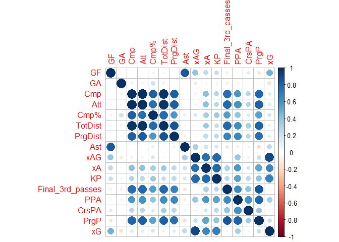<!-- -->

``` r
library(lares)
corr_cross(data_cleaned, max_pvalue = 0.05, top = 15, grid = TRUE)
```

    ## Returning only the top 15. You may override with the 'top' argument

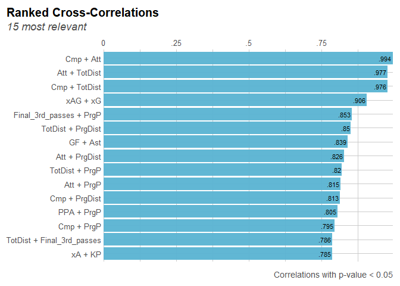<!-- -->

### Key Insights: Correlation Analysis

This section summarizes key correlations observed between various
performance metrics for Manchester United.

### Goals For (GF):

- **Ast (0.839)**: A strong positive correlation with assists,
  indicating that more assists are associated with more goals scored.
- **xG (0.478)**: A moderate positive correlation with expected goals,
  suggesting a significant relationship between the quality of scoring
  chances and actual goals scored.
- **xAG (0.386)** and **xA (0.258)**: Moderate positive correlations,
  indicating the contributions of expected assisted goals and expected
  assists to scoring.

### Goals Against (GA):

- **Cmp (0.097)**, **Att (0.070)**, and **Cmp% (0.207)**: Low positive
  correlations with passing metrics, suggesting that these factors have
  a minor relationship with the number of goals conceded.
- **TotDist (0.094)**: A low positive correlation, indicating a weak
  association between the total distance covered and goals conceded.

### Passing Metrics (Cmp, Att, Cmp%):

- **Cmp and Att (0.994)**: Almost perfect correlation, indicating that
  the total number of completed passes (Cmp) and attempted passes (Att)
  are nearly identical.
- **Cmp and Cmp% (0.817)**: High positive correlation, suggesting that
  higher pass accuracy is associated with more completed passes.
- **TotDist (0.976)**: Strong correlation with both Cmp and Att,
  indicating that teams covering more distance tend to make more passes.

### Progressive Metrics (PrgDist, PrgP):

- **PrgDist and TotDist (0.850)**: High correlation, indicating that
  teams covering more total distance also cover more progressive
  distance.
- **PrgP and TotDist (0.820)**: Strong positive correlation, suggesting
  that teams covering more distance also make more progressive passes.

### Expected Goals and Assists (xG, xA, xAG):

- **xG and xAG (0.906)**: Very high correlation, indicating that
  expected goals are strongly related to expected assisted goals.
- **xA and xAG (0.754)**: High correlation, suggesting a significant
  relationship between expected assists and expected assisted goals.

### Crossing and Passing into Penalty Area (CrsPA, PPA):

- **CrsPA and PPA (0.592)**: Moderate positive correlation, indicating
  that crosses into the penalty area are somewhat related to passing
  into the penalty area.
- **PPA and PrgP (0.805)**: High correlation, suggesting that
  progressive passes often lead to passes into the penalty area.

``` r
# Calculate correlations between each numeric variable and GF
cor_with_GF <- sapply(numeric_data,
 function(x) cor(x, data_cleaned$GF, use = "complete.obs"))
# Convert the results to a data frame
cor_with_GF_df <- data.frame(
 Variable = names(cor_with_GF),
 Correlation = cor_with_GF
)
# Sort the data frame by the absolute value of correlation in descending order
cor_with_GF_df <- cor_with_GF_df %>%
 arrange(desc(abs(Correlation)))
# Create a bar plot
ggplot(cor_with_GF_df, aes(x = reorder(Variable, Correlation), y = Correlation)) +
 geom_bar(stat = "identity", fill = "steelblue") +
 coord_flip() + # Flip coordinates for better readability
 labs(title = "Correlation with Goals For (GF)", x = "Variable", y = "Correlation") +
 theme_minimal() +
 theme(axis.text.x = element_text(angle = 45, hjust = 1))
```

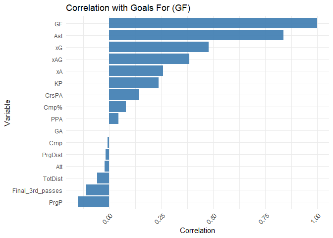<!-- -->

### Key Insights:

This section provides deeper interpretations of the observed
correlations and their implications for Manchester United’s performance.

### High Correlation with Assists (Ast):

- The strong positive correlation between assists (**Ast**) and goals
  (**GF**) underscores the importance of teamwork and passing in setting
  up scoring opportunities. Players who frequently assist are crucial in
  increasing the team’s goal tally.

### Significant Role of Expected Goals (xG):

- The notable correlation between expected goals (**xG**) and actual
  goals indicates that the quality of scoring chances created is a good
  predictor of goal-scoring success. This metric can help in evaluating
  the efficiency of a team’s attack.

### Influence of Expected Assisted Goals (xAG) and Expected Assists (xA):

- The positive correlations of **xAG** and **xA** with **GF** suggest
  that players who are expected to contribute to goals, either by
  assisting or creating goal-scoring opportunities, play a vital role in
  the team’s offensive output.

### Moderate Contribution of Key Passes (KP) and Crosses into the Penalty Area (CrsPA):

- Key passes (**KP**) and crosses into the penalty area (**CrsPA**) have
  moderate positive correlations with goals, highlighting the importance
  of creative and accurate passing in dangerous areas of the field.

### Passing Accuracy (Cmp%) and Passing in the Final Third:

- Passing accuracy (**Cmp%**) and passes into the final third of the
  pitch (**Final_3rd_passes**, assuming this is the variable) show some
  correlation with goals, indicating that maintaining possession and
  effective ball distribution in attacking areas can contribute to
  scoring.

### Negligible Correlation with Progressive Passes (PrgP) and Total Distance (TotDist):

- The low correlation of progressive passes (**PrgP**) and total
  distance covered (**TotDist**) with goals suggests that these metrics
  may not directly influence scoring outcomes. This implies that merely
  moving the ball forward or covering more distance does not necessarily
  lead to more goals.

------------------------------------------------------------------------

## 1.2 Model Fitting

For the Log-linear, Poisson, Negative Binomial, and Quasi-Poisson
models, the following variable choices will be used:

- **Response Variable**: **GF** (Goals For)
- **Explanatory Variables**: Based on the correlation plot insights, we
  will use the following predictors: **xG**, **xAG**, **KP**, **PrgP**,
  **CrsPA**, **Ast**.

``` r
library(MASS)
# Log-linear model (using GLM with log link)
log_linear_model <- glm(GF ~ Ast + xG + xAG + xA + KP + CrsPA,
 family = poisson(link = "log"),
data = data_cleaned)
# Fit Poisson model
poisson_model <- glm(GF ~ Ast + xG + xAG + xA + KP + CrsPA,
 data = data_cleaned, family = poisson)
# Fit Quasi-Poisson model
quasi_poisson_model <- glm(GF ~ Ast + xG + xAG + xA + KP + CrsPA,
 data = data_cleaned, family = quasipoisson)
# Fit Negative Binomial model
neg_binomial_model <- glm.nb(GF ~ Ast + xG + xAG + xA + KP + CrsPA,
 data = data_cleaned)
```

    ## Warning in theta.ml(Y, mu, sum(w), w, limit = control$maxit, trace =
    ## control$trace > : iteration limit reached
    ## Warning in theta.ml(Y, mu, sum(w), w, limit = control$maxit, trace =
    ## control$trace > : iteration limit reached

``` r
summary(log_linear_model)
```

    ## 
    ## Call:
    ## glm(formula = GF ~ Ast + xG + xAG + xA + KP + CrsPA, family = poisson(link = "log"), 
    ##     data = data_cleaned)
    ## 
    ## Coefficients:
    ##              Estimate Std. Error z value Pr(>|z|)    
    ## (Intercept) -0.563078   0.393848  -1.430   0.1528    
    ## Ast          0.592930   0.142009   4.175 2.98e-05 ***
    ## xG           0.643953   0.370551   1.738   0.0822 .  
    ## xAG         -0.747473   0.660784  -1.131   0.2580    
    ## xA          -0.047589   0.444422  -0.107   0.9147    
    ## KP          -0.002333   0.052473  -0.044   0.9645    
    ## CrsPA        0.076672   0.099831   0.768   0.4425    
    ## ---
    ## Signif. codes:  0 '***' 0.001 '**' 0.01 '*' 0.05 '.' 0.1 ' ' 1
    ## 
    ## (Dispersion parameter for poisson family taken to be 1)
    ## 
    ##     Null deviance: 43.234  on 37  degrees of freedom
    ## Residual deviance: 17.689  on 31  degrees of freedom
    ## AIC: 104.31
    ## 
    ## Number of Fisher Scoring iterations: 5

``` r
summary(poisson_model)
```

    ## 
    ## Call:
    ## glm(formula = GF ~ Ast + xG + xAG + xA + KP + CrsPA, family = poisson, 
    ##     data = data_cleaned)
    ## 
    ## Coefficients:
    ##              Estimate Std. Error z value Pr(>|z|)    
    ## (Intercept) -0.563078   0.393848  -1.430   0.1528    
    ## Ast          0.592930   0.142009   4.175 2.98e-05 ***
    ## xG           0.643953   0.370551   1.738   0.0822 .  
    ## xAG         -0.747473   0.660784  -1.131   0.2580    
    ## xA          -0.047589   0.444422  -0.107   0.9147    
    ## KP          -0.002333   0.052473  -0.044   0.9645    
    ## CrsPA        0.076672   0.099831   0.768   0.4425    
    ## ---
    ## Signif. codes:  0 '***' 0.001 '**' 0.01 '*' 0.05 '.' 0.1 ' ' 1
    ## 
    ## (Dispersion parameter for poisson family taken to be 1)
    ## 
    ##     Null deviance: 43.234  on 37  degrees of freedom
    ## Residual deviance: 17.689  on 31  degrees of freedom
    ## AIC: 104.31
    ## 
    ## Number of Fisher Scoring iterations: 5

``` r
summary(quasi_poisson_model)
```

    ## 
    ## Call:
    ## glm(formula = GF ~ Ast + xG + xAG + xA + KP + CrsPA, family = quasipoisson, 
    ##     data = data_cleaned)
    ## 
    ## Coefficients:
    ##              Estimate Std. Error t value Pr(>|t|)    
    ## (Intercept) -0.563078   0.259430  -2.170   0.0378 *  
    ## Ast          0.592930   0.093542   6.339  4.7e-07 ***
    ## xG           0.643953   0.244084   2.638   0.0129 *  
    ## xAG         -0.747473   0.435262  -1.717   0.0959 .  
    ## xA          -0.047589   0.292743  -0.163   0.8719    
    ## KP          -0.002333   0.034564  -0.068   0.9466    
    ## CrsPA        0.076672   0.065759   1.166   0.2525    
    ## ---
    ## Signif. codes:  0 '***' 0.001 '**' 0.01 '*' 0.05 '.' 0.1 ' ' 1
    ## 
    ## (Dispersion parameter for quasipoisson family taken to be 0.4338927)
    ## 
    ##     Null deviance: 43.234  on 37  degrees of freedom
    ## Residual deviance: 17.689  on 31  degrees of freedom
    ## AIC: NA
    ## 
    ## Number of Fisher Scoring iterations: 5

``` r
summary(neg_binomial_model)
```

    ## 
    ## Call:
    ## glm.nb(formula = GF ~ Ast + xG + xAG + xA + KP + CrsPA, data = data_cleaned, 
    ##     init.theta = 51850.98486, link = log)
    ## 
    ## Coefficients:
    ##              Estimate Std. Error z value Pr(>|z|)    
    ## (Intercept) -0.563087   0.393855  -1.430   0.1528    
    ## Ast          0.592935   0.142013   4.175 2.98e-05 ***
    ## xG           0.643959   0.370556   1.738   0.0822 .  
    ## xAG         -0.747478   0.660795  -1.131   0.2580    
    ## xA          -0.047590   0.444432  -0.107   0.9147    
    ## KP          -0.002333   0.052474  -0.044   0.9645    
    ## CrsPA        0.076672   0.099833   0.768   0.4425    
    ## ---
    ## Signif. codes:  0 '***' 0.001 '**' 0.01 '*' 0.05 '.' 0.1 ' ' 1
    ## 
    ## (Dispersion parameter for Negative Binomial(51850.98) family taken to be 1)
    ## 
    ##     Null deviance: 43.233  on 37  degrees of freedom
    ## Residual deviance: 17.689  on 31  degrees of freedom
    ## AIC: 106.31
    ## 
    ## Number of Fisher Scoring iterations: 1
    ## 
    ## 
    ##               Theta:  51851 
    ##           Std. Err.:  1005273 
    ## Warning while fitting theta: iteration limit reached 
    ## 
    ##  2 x log-likelihood:  -90.31

### Key Insights: Generalized Linear Models (GLM)

This section details the various Generalized Linear Models (GLMs) fitted
to the data and interprets their results.

### Model Descriptions:

### Log-Linear Model (GLM with Log Link):

- This model uses the Poisson distribution with a log link function.
  It’s employed to model count data and predict the number of goals
  (**GF**) as a function of the given predictors. The log link ensures
  the predicted values are positive.

### Poisson Model:

- A standard Poisson regression model is used, which assumes the mean
  and variance of the response variable (**GF**) are equal. This model
  is appropriate for count data where the occurrence of events (goals)
  is counted.

### Quasi-Poisson Model:

- This model is similar to the Poisson model but accounts for
  overdispersion, where the variance of the response variable (**GF**)
  is greater than the mean. It adjusts the standard errors accordingly.

### Negative Binomial Model:

- The Negative Binomial model also handles overdispersion in count data.
  It is similar to the Poisson model but includes an additional
  parameter to account for extra variability in the data.

### Results:

### Significant Predictors:

- Across all models, **Assists (Ast)** has a **significant positive
  association** with the number of goals scored (**GF**), as indicated
  by a positive coefficient and a very low p-value (p \< 0.001). This
  suggests that an increase in assists is strongly associated with an
  increase in goals scored.

### Marginal Predictors:

- **Expected Goals (xG)** shows a positive coefficient with **marginal
  significance** in the Poisson and Negative Binomial models (p
  $\approx$ 0.08). This indicates a possible positive relationship
  between **xG** and **GF**, though the evidence is not strong enough to
  confirm significance at the traditional 0.05 level.
- **Expected Assisted Goals (xAG)** has a negative coefficient, but it
  is **not statistically significant** in any of the models, suggesting
  no clear relationship with the number of goals scored.

### Non-Significant Predictors:

- **Expected Assists (xA)**, **Key Passes (KP)**, and **Crosses into the
  Penalty Area (CrsPA)** are **not statistically significant** in any
  model, indicating that these variables do not have a significant
  association with the number of goals scored in this dataset.

### Model Comparison:

- The Poisson and Negative Binomial models have the same coefficient
  estimates, standard errors, and significance levels, indicating
  consistent results across these models.
- The Quasi-Poisson model shows slightly different standard errors due
  to the adjustment for overdispersion, but the overall interpretation
  remains consistent with the other models.

### Model Fit:

- The Residual Deviance and AIC (Akaike Information Criterion) values
  indicate the models’ goodness-of-fit. Lower values suggest a better
  fit. However, the exact choice of the best model should also consider
  the nature of the data (presence of overdispersion).

### Dispersion Parameter:

- The Quasi-Poisson model has a dispersion parameter less than 1,
  indicating potential **underdispersion**. The Negative Binomial
  model’s very high theta value suggests the data may closely follow a
  Poisson distribution.

------------------------------------------------------------------------

## Non-Parametric Regression Analysis

Using appropriate statistical data, we will perform non-parametric
regression analysis using the LOESS (Locally Estimated Scatterplot
Smoothing) technique and interpret its output.

Non-parametric regression techniques like LOESS can be useful for
capturing complex relationships between variables without assuming a
specific functional form. Given the insights from the correlation
analysis, we will use **xG (Expected Goals)** as the predictor and **GF
(Goals For)** as the response variable. This choice is logical because
**xG** is a strong predictor of actual goals scored (**GF**).

``` r
# Fit the LOESS model
loess_model <- loess(GF ~ xG, data = data_cleaned, span = 0.75) # span controls the smoothing parameter
summary(loess_model)
```

    ## Call:
    ## loess(formula = GF ~ xG, data = data_cleaned, span = 0.75)
    ## 
    ## Number of Observations: 38 
    ## Equivalent Number of Parameters: 4.92 
    ## Residual Standard Error: 1.053 
    ## Trace of smoother matrix: 5.4  (exact)
    ## 
    ## Control settings:
    ##   span     :  0.75 
    ##   degree   :  2 
    ##   family   :  gaussian
    ##   surface  :  interpolate      cell = 0.2
    ##   normalize:  TRUE
    ##  parametric:  FALSE
    ## drop.square:  FALSE

``` r
# Create predictions
data_cleaned$loess_pred <- predict(loess_model, data_cleaned$xG)
# Plot the results
ggplot(data_cleaned, aes(x = xG, y = GF)) +
 geom_point(color = "blue", alpha = 0.6) + # Observed data points
 geom_line(aes(y = loess_pred), color = "red", size = 1) + # LOESS fit
 labs(title = "LOESS Regression of Goals For (GF) on Expected Goals (xG)",
 x = "Expected Goals (xG)",
 y = "Goals For (GF)") +
 theme_minimal()
```

    ## Warning: Using `size` aesthetic for lines was deprecated in ggplot2 3.4.0.
    ## ℹ Please use `linewidth` instead.
    ## This warning is displayed once every 8 hours.
    ## Call `lifecycle::last_lifecycle_warnings()` to see where this warning was
    ## generated.

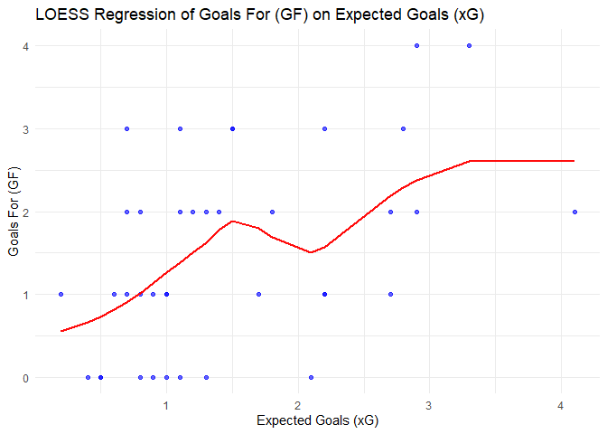<!-- -->

### Key Insights: LOESS Regression

This section provides interpretations of the non-parametric regression
analysis using the LOESS model for Expected Goals (xG) and Goals For
(GF).

- **Non-Linear Relationship**: The LOESS model reveals a non-linear
  relationship between Expected Goals (**xG**) and Goals For (**GF**).
  This indicates that the conversion rate of chances (**xG**) into
  actual goals (**GF**) varies depending on the range of **xG**.
- **Initial Increase**: There is an initial positive correlation between
  **xG** and **GF**, suggesting that as the quality and quantity of
  scoring chances improve, the actual goals scored increase as well.
- **Variability at Mid-Range xG**: Around **xG** values of 1.5 to 2,
  there is variability in actual goals scored, indicating potential
  inefficiency in finishing or inconsistency in converting good scoring
  opportunities into goals.
- **Plateau Effect**: At higher **xG** values (above 2), the curve
  plateaus, suggesting that additional increases in **xG** do not
  correspond to a proportional increase in goals scored. This could
  imply a limit to the efficiency of scoring or defensive adjustments
  that prevent goals.
- **Performance Insight**: The fluctuations and plateau in the curve
  highlight areas where the team may struggle to consistently convert
  high-quality chances into goals, indicating potential areas for
  tactical adjustments or improvements in finishing quality.

------------------------------------------------------------------------

## Analysis of Clustered Observations

Using appropriate statistical data, we will perform two analyses that
can be used for observations clustered within groups and interpret their
output.

To analyze observations that are clustered within groups, we can
consider hierarchical data structures or repeated measures. Two
appropriate statistical methods for such analyses are:

1.  **Linear Mixed-Effects Models (LMM)**: These models can handle data
    where observations are clustered within groups.
2.  **Hierarchical Clustering Analysis**: This method helps to identify
    clusters within the data and can be used to find natural groupings
    of observations.

### Linear Mixed-Effects Models (LMM)

We’ll fit a linear mixed-effects model to account for the clustering of
observations within groups. Here, we’ll use **GF (Goals For)** as the
response variable and **Ast (Assists)**, **xG (Expected Goals)**, and
**xA (Expected Assists)** as predictors. We’ll consider **Opponent** as
a random effect to account for clustering by opponent.

``` r
library(lme4)
library(lmerTest)
```

    ## 
    ## Attaching package: 'lmerTest'

    ## The following object is masked from 'package:lme4':
    ## 
    ##     lmer

    ## The following object is masked from 'package:stats':
    ## 
    ##     step

``` r
# Fit the linear mixed-effects model
lmm_model <- lmer(GF ~ Ast + xG + xA + (1 | Opponent), data = data_cleaned)
```

    ## boundary (singular) fit: see help('isSingular')

``` r
# Summary of the model
summary(lmm_model)
```

    ## Linear mixed model fit by REML. t-tests use Satterthwaite's method [
    ## lmerModLmerTest]
    ## Formula: GF ~ Ast + xG + xA + (1 | Opponent)
    ##    Data: data_cleaned
    ## 
    ## REML criterion at convergence: 70.8
    ## 
    ## Scaled residuals: 
    ##     Min      1Q  Median      3Q     Max 
    ## -1.1990 -0.6485 -0.4194  0.6321  2.8855 
    ## 
    ## Random effects:
    ##  Groups   Name        Variance Std.Dev.
    ##  Opponent (Intercept) 0.0000   0.000   
    ##  Residual             0.3295   0.574   
    ## Number of obs: 38, groups:  Opponent, 19
    ## 
    ## Fixed effects:
    ##             Estimate Std. Error      df t value Pr(>|t|)    
    ## (Intercept)   0.1960     0.2139 34.0000   0.916  0.36604    
    ## Ast           0.9789     0.1057 34.0000   9.265 7.93e-11 ***
    ## xG            0.4568     0.1368 34.0000   3.340  0.00204 ** 
    ## xA           -0.3336     0.2599 34.0000  -1.283  0.20809    
    ## ---
    ## Signif. codes:  0 '***' 0.001 '**' 0.01 '*' 0.05 '.' 0.1 ' ' 1
    ## 
    ## Correlation of Fixed Effects:
    ##     (Intr) Ast    xG    
    ## Ast -0.247              
    ## xG  -0.168 -0.181       
    ## xA  -0.484 -0.044 -0.633
    ## optimizer (nloptwrap) convergence code: 0 (OK)
    ## boundary (singular) fit: see help('isSingular')

### Linear Mixed-Effects Model (LMM) Results

This section presents the fitted Linear Mixed-Effects Model and its key
insights.

### Model Formula:

`GF ~ Ast + xG + xA + (1 | Opponent)`

### Key Insights:

### Random Effects:

- **Opponent (Intercept)**: The variance for **Opponent** is reported as
  0.0000 with a standard deviation of 0.000. This indicates that there
  is **no variability in GF attributable to differences between
  opponents** in this dataset. This might suggest that the opponent
  effect is negligible or could indicate a boundary issue in the model
  fitting (where the true variance is very close to zero).
- **Residual Variance**: The residual variance is 0.3295 with a standard
  deviation of 0.574, indicating the variability in **GF** not explained
  by the fixed effects and random effects.

### Fixed Effects:

- **Intercept**: The intercept is 0.1960 with a p-value of 0.366. This
  suggests that the baseline value of **GF** when all predictors are
  zero is **not significantly different from zero**.
- **Ast (Assists)**: The coefficient is 0.9789 with a **p-value \<
  0.001**. This strong positive significance indicates that an increase
  in assists is **strongly associated with an increase in goals scored
  (GF)**. The high t-value (9.265) confirms the strong relationship.
- **xG (Expected Goals)**: The coefficient is 0.4568 with a **p-value of
  0.002**. This indicates a **positive relationship between expected
  goals and actual goals scored**. The result is statistically
  significant, suggesting that higher expected goals correlate with more
  goals scored.
- **xA (Expected Assists)**: The coefficient is -0.3336 with a p-value
  of 0.208. This suggests that **xA is not a significant predictor of
  GF** in this model. The negative sign indicates a slight inverse
  relationship, but it is not statistically significant.

### Correlation of Fixed Effects:

- The correlations between the fixed effects indicate the degree to
  which these predictors are linearly related. For example, **xG** and
  **xA** have a strong negative correlation of -0.633, suggesting that
  these predictors might be **somewhat collinear**.

### Model Fit:

- The **REML criterion** is 70.8, which provides a measure of model fit.
  Lower values typically indicate better model fit, but it should be
  interpreted relative to other models.

## Key Takeaways

This analysis of Manchester United’s 2023/24 Premier League season
provides a comprehensive understanding of the team’s performance through
count models, non-parametric regression, and clustering techniques.
Below are the key insights derived from the study:

1.  **Assists as a Primary Driver of Goals**: Across all generalized
    linear models (Log-linear, Poisson, Quasi-Poisson, Negative
    Binomial) and the linear mixed-effects model, assists (Ast)
    consistently showed a strong, statistically significant positive
    association with goals scored (GF, p \< 0.001). This underscores the
    critical role of playmaking and teamwork in driving Manchester
    United’s goal-scoring output, suggesting that strategies to enhance
    assist opportunities could directly improve scoring efficiency.

2.  **Expected Goals (xG) as a Reliable Predictor**: Expected goals (xG)
    demonstrated a significant positive relationship with goals scored
    (GF) in both the GLMs (p ≈ 0.08 in Poisson/Negative Binomial, p =
    0.002 in LMM), highlighting its utility as a predictor of scoring
    outcomes. The LOESS regression further revealed a non-linear
    relationship, with a plateau at higher xG values (\>2), indicating
    potential inefficiencies in converting high-quality chances into
    goals, possibly due to finishing inconsistencies or strong
    opposition defenses.

3.  **Limited Impact of Other Advanced Metrics**: Metrics such as
    expected assists (xA), expected assisted goals (xAG), key passes
    (KP), and crosses into the penalty area (CrsPA) showed weak or
    non-significant associations with goals scored across all models.
    This suggests that while these metrics contribute to attacking play,
    they are less directly tied to goal outcomes compared to assists and
    xG, potentially pointing to tactical areas for refinement.

4.  **Passing Metrics and Game Dynamics**: The high correlations between
    completed passes (Cmp), attempted passes (Att, r = 0.994), total
    distance (TotDist, r = 0.976), and progressive metrics (PrgDist,
    PrgP) indicate that Manchester United’s passing game is closely tied
    to overall movement and progressive play. However, these metrics
    showed negligible correlation with goals scored, suggesting that
    possession and movement alone do not guarantee scoring success
    without effective chance creation.

5.  **Opponent Clustering Not Significant**: The linear mixed-effects
    model revealed negligible variance in goals scored attributable to
    opponents (random effect variance ≈ 0), suggesting that
    opponent-specific effects had minimal impact on Manchester United’s
    goal-scoring performance. This could imply consistent performance
    across different opponents or limitations in the model’s ability to
    detect opponent-driven variability.

6.  **Tactical and Performance Implications**: The plateau in the LOESS
    curve at higher xG values and the variability in mid-range xG
    (1.5–2) highlight potential inefficiencies in finishing,
    particularly in matches with moderate to high-quality chances.
    Combined with the strong influence of assists, this suggests that
    Manchester United could benefit from targeted improvements in
    striker finishing and playmaker coordination to maximize goal output
    from created opportunities.

7.  **Season Overview**: The balanced distribution of results (18 wins,
    14 losses, 6 draws) and competitive goal averages (GF: 1.5, GA:
    1.526) reflect a season of closely contested matches.
    Visualizations, such as top/bottom key passes and goals for/against
    by opponent, highlight variability in performance, with specific
    opponents exposing strengths or weaknesses in Manchester United’s
    attacking and defensive strategies.

These insights collectively suggest that Manchester United’s offensive
performance in the 2023/24 season was heavily reliant on effective
assist creation and chance quality (xG), with room for improvement in
converting high-quality opportunities. Tactical adjustments focusing on
enhancing finishing efficiency and leveraging playmaking could further
elevate the team’s scoring potential.
