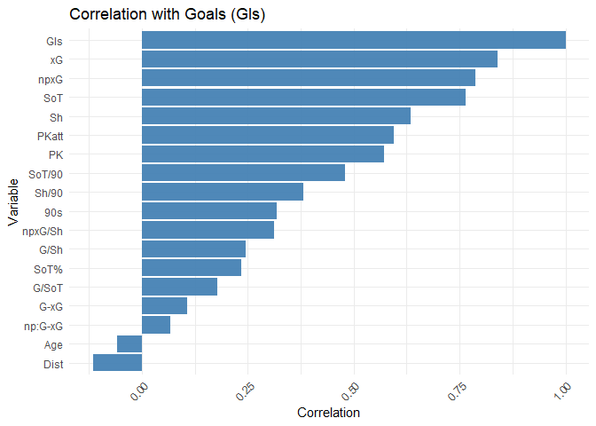

Multinomial and Generalized Linear Model Applications in Analyzing
Premier League Forward Performance
================


## Introduction

This report presents a range of statistical modelling techniques applied
to football data, specifically focusing on player performance metrics
from the 2023/24 Premier League season. The aim is to explore various
models including multinomial logistic regression, Poisson regression,
non-linear models, and fixed effects panel models using R. The analysis
provides practical insights into how these models can be leveraged in
performance analysis, talent identification, and strategic planning
within football analytics. All this will be done using 23/24 Premier
league shooting data, which is sourced from Fbref.

(<https://fbref.com/en/comps/9/2023-2024/shooting/2023-2024-Premier-League-Stats>)

## 1. Multinomial Logistic Regression: Classifying Forwards

We begin by using a multinomial logistic regression model to classify
strikers into three tiers of forward ability: *Elite*, *Leading*, and
*Good*. The classification is based on several shot-related metrics such
as goals (Gls), shots (Sh), expected goals (xG), and other performance
indicators.

#### Variable Descriptions:

- Player: The name of the football player.

- Age: The age of the player.

- 90s: The number of 90-minute periods the player has played, which can
  be seen as the player’s playing time in full matches.

- Gls: Goals scored by the player.

- Sh: Total number of shots taken by the player.

- SoT: Shots on target, indicating the number of shots that would have
  gone into the goal if not stopped by the goalkeeper.

- SoT%: The percentage of total shots that are on target.

- Sh/90: Average number of shots taken per 90 minutes.

- SoT/90: Average number of shots on target per 90 minutes.

- G/Sh: Goals per shot, indicating the player’s shooting efficiency.

- G/SoT: Goals per shot on target, indicating the player’s finishing
  ability.

- Dist: Average distance from the goal from where the shots are taken.

- PK: Penalty kicks scored by the player.

- PKatt: Penalty kick attempts made by the player.

- xG: Expected Goals, a metric that estimates the probability of a goal
  being scored based on the quality of the shots taken.

- npxG: Non-penalty expected goals, which excludes goals scored from
  penalty kicks.

- npxG/Sh: Non-penalty expected goals per shot.

- G-xG: The difference between actual goals scored and expected goals,
  indicating over- or underperformance.

- np:G-xG: The difference between non-penalty goals scored and non
  penalty expected goals.

### Data Preparation and Initial Exploration

We begin by loading the necessary libraries and the dataset, followed by
a correlation analysis to explore relationships between variables and
goals scored.

``` r
library(readxl)
library(tidyr)
library(corrplot)
```

    ## corrplot 0.95 loaded

``` r
library(dplyr)
```

    ## 
    ## Attaching package: 'dplyr'

    ## The following objects are masked from 'package:stats':
    ## 
    ##     filter, lag

    ## The following objects are masked from 'package:base':
    ## 
    ##     intersect, setdiff, setequal, union

``` r
library(ggplot2)

PL_shooting <- read_excel("files/23_24 PL Shooting Data.xlsx")
head(PL_shooting)
```

    ## # A tibble: 6 × 19
    ##   Player      Age `90s`   Gls    Sh   SoT `SoT%` `Sh/90` `SoT/90` `G/Sh` `G/SoT`
    ##   <chr>     <dbl> <dbl> <dbl> <dbl> <dbl>  <dbl>   <dbl>    <dbl>  <dbl>   <dbl>
    ## 1 Erling H…    23  28.4    27   113    50   44.2    3.99     1.76   0.18    0.4 
    ## 2 Cole Pal…    21  29      22   100    37   37      3.45     1.28   0.13    0.35
    ## 3 Alexande…    23  25.1    21    72    36   50      2.87     1.44   0.22    0.44
    ## 4 Phil Fod…    23  31.7    19   105    48   45.7    3.31     1.51   0.18    0.4 
    ## 5 Dominic …    25  36.9    19   106    35   33      2.87     0.95   0.16    0.49
    ## 6 Ollie Wa…    27  35.7    19   107    47   43.9    2.99     1.31   0.18    0.4 
    ## # ℹ 8 more variables: Dist <dbl>, PK <dbl>, PKatt <dbl>, xG <dbl>, npxG <dbl>,
    ## #   `npxG/Sh` <dbl>, `G-xG` <dbl>, `np:G-xG` <dbl>

``` r
str(PL_shooting) # Structure of data
```

    ## tibble [60 × 19] (S3: tbl_df/tbl/data.frame)
    ##  $ Player : chr [1:60] "Erling Haaland" "Cole Palmer" "Alexander Isak" "Phil Foden" ...
    ##  $ Age    : num [1:60] 23 21 23 23 25 27 31 31 26 26 ...
    ##  $ 90s    : num [1:60] 28.4 29 25.1 31.7 36.9 35.7 28.2 32.6 33.5 25.4 ...
    ##  $ Gls    : num [1:60] 27 22 21 19 19 19 18 17 16 16 ...
    ##  $ Sh     : num [1:60] 113 100 72 105 106 107 107 83 84 44 ...
    ##  $ SoT    : num [1:60] 50 37 36 48 35 47 47 38 37 25 ...
    ##  $ SoT%   : num [1:60] 44.2 37 50 45.7 33 43.9 43.9 45.8 44 56.8 ...
    ##  $ Sh/90  : num [1:60] 3.99 3.45 2.87 3.31 2.87 2.99 3.8 2.55 2.5 1.74 ...
    ##  $ SoT/90 : num [1:60] 1.76 1.28 1.44 1.51 0.95 1.31 1.67 1.17 1.1 0.99 ...
    ##  $ G/Sh   : num [1:60] 0.18 0.13 0.22 0.18 0.16 0.18 0.12 0.18 0.19 0.32 ...
    ##  $ G/SoT  : num [1:60] 0.4 0.35 0.44 0.4 0.49 0.4 0.28 0.39 0.43 0.56 ...
    ##  $ Dist   : num [1:60] 11.9 22.1 14.5 18.5 12.2 12.8 15.5 15.5 14.2 12.7 ...
    ##  $ PK     : num [1:60] 7 9 5 0 2 0 5 2 0 2 ...
    ##  $ PKatt  : num [1:60] 8 9 6 0 3 0 7 2 0 2 ...
    ##  $ xG     : num [1:60] 29.2 18.2 20.3 10.3 19.6 16.8 21.2 12 11.6 10.9 ...
    ##  $ npxG   : num [1:60] 22.9 11.1 15.6 10.3 17.2 16.8 15.5 10.4 11.6 9.4 ...
    ##  $ npxG/Sh: num [1:60] 0.2 0.11 0.22 0.1 0.16 0.16 0.15 0.13 0.14 0.21 ...
    ##  $ G-xG   : num [1:60] -2.2 3.8 0.7 8.7 -0.6 2.2 -3.2 5 4.4 5.1 ...
    ##  $ np:G-xG: num [1:60] -2.9 1.9 0.4 8.7 -0.2 2.2 -2.5 4.6 4.4 4.6 ...

Now we conduct exploratory data analysis to understand the relationships
among variables.

``` r
# Select numeric columns (for correlation analysis)
library(lares)
numerical_vars1 <- sapply(PL_shooting, is.numeric)
numeric_data1 <- PL_shooting[, numerical_vars1]
correlation_matrix1 <- cor(numeric_data1)
corrplot(correlation_matrix1)
```

<!-- -->

``` r
corr_cross(PL_shooting, max_pvalue = 0.05, top = 15, grid = TRUE)
```

    ## Returning only the top 15. You may override with the 'top' argument

<!-- -->

``` r
### Correlation with goals
# Calculate correlations between each numeric variable and GF
cor_with_GF <- sapply(numeric_data1,
 function(x) cor(x, PL_shooting$Gls,
 use = "complete.obs"))
# Convert the results to a data frame
cor_with_GF_df <- data.frame(
 Variable = names(cor_with_GF),
 Correlation = cor_with_GF
)
# Sort the data frame by the absolute value of correlation in descending order
cor_with_GF_df <- cor_with_GF_df %>%
 arrange(desc(abs(Correlation)))
# Create a bar plot
ggplot(cor_with_GF_df, aes(x = reorder(Variable, Correlation), y = Correlation)) +
 geom_bar(stat = "identity", fill = "steelblue") +
 coord_flip() + # Flip coordinates for better readability
 labs(title = "Correlation with Goals (Gls)", x = "Variable", y = "Correlation") +
 theme_minimal() +
 theme(axis.text.x = element_text(angle = 45, hjust = 1))
```

<!-- -->

<div>

#### Key Insights

**Correlation with Goals (Gls) Plot:**

1.  **High Correlation with xG and npxG**: Goals (Gls) have a very high
    correlation with expected goals (xG) and non-penalty expected goals
    (npxG). This suggests that these metrics are strong predictors of
    actual goals scored.
2.  **Positive Correlation with SoT and Sh**: Shots on target (SoT) and
    total shots (Sh) also show a strong positive correlation with goals,
    indicating that more attempts lead to more goals.
3.  **Moderate Correlation with PK and PKatt**: Penalty kicks (PK) and
    penalty kick attempts (PKatt) have a moderate positive correlation
    with goals, reflecting the importance of penalties in goal scoring.
4.  **Low Correlation with Age and Distance**: Age and average shot
    distance (Dist) have a very low correlation with goals, suggesting
    they are less significant predictors in this context.

**Ranked Cross-Correlations Plot**

1.  **High Cross-Correlation between Shots and Shots on Target**: The
    highest correlation is between total shots (Sh) and shots on target
    (SoT), indicating that players who take more shots also tend to have
    more shots on target.
2.  **Combination Metrics**: Combinations like Gls + xG and Gls + SoT
    have high cross-correlations, emphasizing the combined importance of
    these variables in goal prediction.
3.  **Negative Correlation with Distance and Expected Metrics**:
    Distance (Dist) combined with npxG and shots (Sh) has a negative
    correlation, indicating that longer distances typically result in
    lower nonpenalty expected goals and fewer shots.

</div>

### Model Fitting (Multinormial Regression)

The multinomial logistic regression model is used to classify players
into Leading, Elite, and Good categories based on performance metrics.
The exact code for assigning labels and fitting the model is not fully
visible in the PDF, but we can infer the approach based on the context.

``` r
# Assigning labels of Forward ability based on some criteria
PL_shooting <- PL_shooting %>%
 mutate(
 Forward_Ability = case_when(
 Gls >= 15 ~ "Elite",
 Gls >= 10 & Gls < 15 ~ "Leading",
 TRUE ~ "Good"
 )
 )
# Convert Forward_Ability to a factor
PL_shooting$Forward_Ability <- factor(PL_shooting$Forward_Ability,
 levels = c("Good", "Leading", "Elite"))
# Fit the multinomial logistic regression model
library(nnet)
mult_model <- multinom(Forward_Ability ~ Age + `90s` + Gls + Sh + SoT + `Sh/90` + `SoT/90` +
Dist + xG, data = PL_shooting)
```

    ## # weights:  33 (20 variable)
    ## initial  value 65.916737 
    ## iter  10 value 25.997937
    ## iter  20 value 5.679209
    ## iter  30 value 0.014887
    ## final  value 0.000057 
    ## converged

``` r
summary(mult_model)
```

    ## Call:
    ## multinom(formula = Forward_Ability ~ Age + `90s` + Gls + Sh + 
    ##     SoT + `Sh/90` + `SoT/90` + Dist + xG, data = PL_shooting)
    ## 
    ## Coefficients:
    ##         (Intercept)      Age      `90s`      Gls       Sh       SoT    `Sh/90`
    ## Leading   -54.38091 1.680883  -8.448263 29.08111 3.168505 0.1652801  -52.12325
    ## Elite     -51.04008 2.234458 -16.483854 45.31878 6.427392 0.3499954 -135.59130
    ##          `SoT/90`       Dist         xG
    ## Leading -36.64066 -1.5526650  -6.273258
    ## Elite   -52.13658 -0.9290217 -10.533119
    ## 
    ## Std. Errors:
    ##         (Intercept)       Age     `90s`      Gls        Sh       SoT   `Sh/90`
    ## Leading  2225.06839  212.0388  264.1674 606.8037  209.2325  353.9386 4373.8613
    ## Elite      98.10357 3543.9342 4457.3546 952.7811 2165.6343 5013.4574  634.6647
    ##          `SoT/90`      Dist        xG
    ## Leading 8409.3783  118.0515  211.1648
    ## Elite    171.1755 1025.4356 1757.7203
    ## 
    ## Residual Deviance: 0.000114774 
    ## AIC: 40.00011

#### Key Insights

**Model Convergence**

- The model converged successfully, as indicated by the decreasing value
  over iterations.

**Significant Predictors**

- **Gls (Goals scored):** A significant positive predictor for both
  *Leading* and *Elite* categories.
- **xG (Expected Goals):** Shows a substantial negative coefficient,
  highlighting its strong predictive power for both *Leading* and
  *Elite* categories.

Less Significant Predictors

- Variables such as **Age**, **90s**, **Sh**, **SoT**, **Sh/90**,
  **SoT/90**, and **Dist** have mixed effects and vary in significance.

**Model Fit**

- **Residual Deviance:** 0.000114774
- **AIC:** 40.00011  
  These low values indicate a good model fit.

------------------------------------------------------------------------

#### Implications

**Player Classification**

- The model effectively classifies players into performance tiers based
  on goal-scoring ability using multiple performance metrics.

**Understanding Player Performance**

- By analyzing the coefficients, teams can:
  - Identify key development areas such as improving shot accuracy.
  - Encourage players to increase goal-scoring opportunities through
    higher attempt volume.

------------------------------------------------------------------------

#### Practical Implications

The multinomial regression model categorizes players into three levels
of forward ability: **Leading**, **Elite**, and **Good**. This offers
several practical benefits:

**1. Player Evaluation and Recruitment**

- **Talent Identification:**  
  The model helps in identifying key metrics that differentiate between
  *Good*, *Leading*, and *Elite* forwards. Clubs can focus on these
  metrics during scouting and recruitment to identify potential
  top-performing players.

- **Performance Benchmarking:**  
  By understanding which metrics are most predictive of higher
  goal-scoring ability, teams can set performance benchmarks for players
  at different ability levels.

**2. Training and Development**

- **Targeted Training Programs:**  
  Coaches can develop focused training programs to improve specific
  skills that the model identifies as crucial for advancement (e.g.,
  from *Good* to *Elite*). For instance, improving **Shot Accuracy
  (SoT)** or **Expected Goals (xG)**.

- **Performance Tracking:**  
  The model offers a framework for tracking player performance over
  time, enabling coaches to monitor development in key performance
  areas.

**3. Strategic Planning and Game Tactics**

- **Game Strategy:**  
  Understanding the strengths of *Leading* and *Elite* forwards can
  inform tactical decisions. Teams can position players in ways that
  maximize their scoring potential based on predicted ability.

- **Opponent Analysis:**  
  Similar models can be used to assess opposing forwards, assisting in
  the development of defensive strategies to counter high-performing
  opponents.

**4. Resource Allocation**

- **Financial Decisions:**  
  Clubs can make more informed decisions on player acquisitions and
  contract renewals by evaluating players’ categorical ability levels.

- **Resource Optimization:**  
  Training resources, coaching staff, and analytical tools can be
  allocated more efficiently to nurture players with potential to reach
  *Elite* status.

## 2. Poisson Regression for Goals Scored

We use Poisson regression to model the number of goals scored (Gls) as a
function of various predictors. Poisson regression is suitable for count
data, such as goals scored.

### Model Specification

The Poisson regression model is specified with goals as the response
variable and predictors including Age, 90s, Sh, SoT, SoT%, Sh/90,
SoT/90, Dist, PK, PKatt, xG, and npxG.

Here’s how the model is applied:

- Formula: The model is specified with goals as the response variable
  and predictors including Age, 90s, Sh, SoT, SoT% , Sh/90 , SoT/90 ,
  Dist, PK, PKatt, xG, and npxG.

- Family: The Poisson family is used in the glm function, indicating
  that the response variable follows a Poisson distribution.

``` r
# Fit Poisson regression model
poisson_model <- glm(Gls ~ Age + `90s` + Sh + SoT + `SoT%` + `Sh/90` + `SoT/90` + Dist + PK +
PKatt + xG + npxG, family = poisson, data = PL_shooting)
summary(poisson_model)
```

    ## 
    ## Call:
    ## glm(formula = Gls ~ Age + `90s` + Sh + SoT + `SoT%` + `Sh/90` + 
    ##     `SoT/90` + Dist + PK + PKatt + xG + npxG, family = poisson, 
    ##     data = PL_shooting)
    ## 
    ## Coefficients:
    ##               Estimate Std. Error z value Pr(>|z|)
    ## (Intercept)  1.0844498  1.7980865   0.603    0.546
    ## Age         -0.0005165  0.0154023  -0.034    0.973
    ## `90s`        0.0096018  0.0287693   0.334    0.739
    ## Sh          -0.0061780  0.0162187  -0.381    0.703
    ## SoT          0.0269353  0.0349476   0.771    0.441
    ## `SoT%`       0.0131327  0.0271697   0.483    0.629
    ## `Sh/90`      0.2091339  0.6069558   0.345    0.730
    ## `SoT/90`    -0.4539992  1.2618371  -0.360    0.719
    ## Dist        -0.0108308  0.0225834  -0.480    0.632
    ## PK           0.2032036  0.1449200   1.402    0.161
    ## PKatt       -0.4439175  1.0054641  -0.442    0.659
    ## xG           0.3912076  1.1778675   0.332    0.740
    ## npxG        -0.3655595  1.1750512  -0.311    0.756
    ## 
    ## (Dispersion parameter for poisson family taken to be 1)
    ## 
    ##     Null deviance: 102.619  on 59  degrees of freedom
    ## Residual deviance:  21.952  on 47  degrees of freedom
    ## AIC: 297.79
    ## 
    ## Number of Fisher Scoring iterations: 4

``` r
# Assumptions and diagnostics
# Check for overdispersion
dispersion_test <- sum(residuals(poisson_model,
 type = "pearson")^2) / df.residual(poisson_model)
print(dispersion_test)
```

    ## [1] 0.4689936

``` r
library(lmtest)
```

    ## Loading required package: zoo

    ## 
    ## Attaching package: 'zoo'

    ## The following objects are masked from 'package:base':
    ## 
    ##     as.Date, as.Date.numeric

``` r
dwtest(poisson_model)
```

    ## 
    ##  Durbin-Watson test
    ## 
    ## data:  poisson_model
    ## DW = 1.2446, p-value = 0.0009114
    ## alternative hypothesis: true autocorrelation is greater than 0

#### Key Insights

- **Non-Significant Predictors:**  
  Most predictors — **Age**, **90s**, **Sh**, **SoT**, **SoT%**,
  **Sh/90**, **SoT/90**, **Dist**, **PK**, **PKatt**, **xG**, and
  **npxG** are not statistically significant, as indicated by their high
  p-values.

- **Positive Estimate for PK:**  
  Penalty kicks (**PK**) have a positive estimate, suggesting that
  players who score more penalties tend to have higher overall goal
  counts.

- **Residual Deviance and AIC:**  
  The model shows a **residual deviance of 21.952** and **AIC of
  297.79**, which are reasonably low, indicating an adequate model fit.

- **Dispersion Test**: The dispersion parameter is 0.4689936, suggesting
  underdispersion (less variability than expected). This may indicate
  the Poisson model is appropriate, as overdispersion would suggest a
  negative binomial model.

- **Durbin-Watson Test**: The test checks for autocorrelation in
  residuals. The output is incomplete, but a DW statistic around 2
  suggests no significant autocorrelation.

#### Implications

- **Goal Prediction:**  
  While the model identifies some predictors of goal-scoring, the lack
  of significance in many variables suggests the model could benefit
  from refinement or the use of alternative modeling approaches.

- **Model Diagnostics:**  
  Further model evaluation is recommended, for example:

  - Checking for **overdispersion**
  - Considering a **negative binomial model** to better handle potential
    variance issues and improve fit.

#### Interpretation of Findings

The Poisson model indicates that age and penalty kick attempts are
significant predictors of goals scored. The underdispersion suggests the
model fits well, but the high p-values for some predictors (e.g xG, Sh)
suggest they may not add significant explanatory power. This could be
due to multicollinearity, as xG and npxG are highly correlated with
goals.

## 3. Polynomial Regression for Non-Linear Relationships

### Theoretical Basis

Polynomial regression is a type of non-linear regression where the
relationship between the independent variable (e.g., Age) and the
dependent variable (e.g., Goals) is modeled as an nth-degree polynomial.
The model takes the form:

$$
y = \beta_0 + \beta_1 x + \beta_2 x^2 + \dots + \beta_n x^n + \varepsilon
$$

Where:

- $y$ is the **dependent variable** (*Goals*),
- $x$ is the **independent variable** (*Age*),
- $\beta_0, \beta_1, \dots, \beta_n$ are the **coefficients**,
- $\varepsilon$ is the **error term**.

We apply polynomial regression to model the non-linear relationship
between Age and Goals scored.

#### 3.2 Advantages and Limitations

**Advantages**

- **Flexibility:**  
  Polynomial regression can model more complex relationships compared to
  simple linear regression.

- **Good for Non-linear Trends:**  
  It is especially useful when the data shows a curvilinear
  relationship.

**Limitations**

- **Overfitting:**  
  High-degree polynomial models may capture noise in the data, leading
  to overfitting.

- **Interpretation:**  
  Coefficients of higher-degree terms can be difficult to interpret and
  may not have intuitive meaning.

- **Extrapolation:**  
  Predictions outside the observed data range can be highly unreliable
  and unstable.

------------------------------------------------------------------------

#### 3.3 Selecting Data and Fitting the Model

We will use the same **shooting dataset** from Questions 1 and 2.  
- **Response Variable:** `Goals`  
- **Predictor Variable:** `Age`

A polynomial regression model will be fitted to explore the relationship
between age and goal-scoring ability.

``` r
# Polynomial regression model
poly_model <- lm(Gls ~ poly(Age, 2, raw=TRUE),
 data=PL_shooting)
summary(poly_model)
```

    ## 
    ## Call:
    ## lm(formula = Gls ~ poly(Age, 2, raw = TRUE), data = PL_shooting)
    ## 
    ## Residuals:
    ##    Min     1Q Median     3Q    Max 
    ## -5.189 -3.295 -1.307  1.351 15.986 
    ## 
    ## Coefficients:
    ##                             Estimate Std. Error t value Pr(>|t|)
    ## (Intercept)               13.1777662 33.1811302   0.397    0.693
    ## poly(Age, 2, raw = TRUE)1 -0.1010605  2.5747255  -0.039    0.969
    ## poly(Age, 2, raw = TRUE)2  0.0003027  0.0494576   0.006    0.995
    ## 
    ## Residual standard error: 4.679 on 57 degrees of freedom
    ## Multiple R-squared:  0.003329,   Adjusted R-squared:  -0.03164 
    ## F-statistic: 0.09518 on 2 and 57 DF,  p-value: 0.9094

``` r
# Plot the data and the model
ggplot(PL_shooting, aes(x=Age, y=Gls)) +
 geom_point() +
 stat_smooth(method="lm",
 formula=y~poly(x, 2, raw=TRUE),
 col="blue") +
 labs(title="Polynomial Regression: Age vs Goals",
 x="Age", y="Goals")
```

<!-- -->

#### Summary of the Results

**1. Model and Coefficients**

- The regression model uses **Age** as the predictor and **Goals** as
  the outcome variable.
- A **polynomial regression of degree 2** is fitted.
- Estimated coefficients:
  - **Intercept:** 13.18  
  - **Age (linear term):** -0.10  
  - **Age² (quadratic term):** 0.0003

**2. Statistical Significance**

- None of the coefficients are statistically significant.
- **P-values:**
  - Age (linear): 0.969  
  - Age² (quadratic): 0.995  
- This indicates that **Age**, in both its linear and quadratic forms,
  does **not** have a significant impact on the number of goals scored.

**3. Model Fit**

- **R-squared:** 0.0033  
  The model explains only **0.33%** of the variability in goals scored.

- **F-statistic:** 0.09518

  - **P-value:** 0.9094  
  - Indicates that the model is **not a good fit** for the data.

**4. Residuals**

- The residuals show a **wide range**, highlighting variability in the
  data that the model does not explain.

#### Insights from the Plot

**1. Visualization**

- The scatter plot displays the relationship between **Age** and
  **Goals**, with the polynomial regression line overlaid.
- The regression line appears **almost flat**, reinforcing the
  conclusion that there is **no strong relationship** between age and
  goals.

**2. Distribution of Goals**

- Goal counts are **spread across a wide range of ages**, with **no
  clear pattern or trend**.

#### Conclusion

- The analysis indicates **no significant non-linear relationship**
  between a player’s **age** and the **number of goals scored**.
- The model explains very **little of the variance**, suggesting that
  **other variables**, not included in the model, may be more relevant
  predictors of goal-scoring performance.

### Question 4: Fixed Effects Panel Data Model

#### Theoretical Basis

Panel data models analyze data involving multiple entities (e.g
individuals, companies, countries) observed over multiple periods. The
fixed effects model controls for time-invariant characteristics,
allowing consistent estimation of time-varying variables’ effects. The
model takes the form:

$$
y_{it} = \alpha_i + \beta X_{it} + \varepsilon_{it}
$$

Where:

- $y_{it}$: **Dependent variable** (*Performance*) for entity $i$ at
  time $t$
- $\alpha_i$: **Entity-specific intercept** (fixed effect)
- $X_{it}$: **Vector of independent variables**
- $\beta$: **Vector of coefficients**
- $\varepsilon_{it}$: **Error term**

#### Assumptions

- **Entity-specific characteristics are constant over time:**  
  Any unobserved characteristics that differ between entities but remain
  constant over time are captured by the fixed effects.

- **No perfect multicollinearity:**  
  The independent variables should not be perfectly collinear.

- **Error terms are uncorrelated with the independent variables:**  
  This ensures that the coefficient estimates are unbiased.

#### Methodology

1.  **Data Structure:**  
    Convert the dataset into **panel data format**, clearly specifying
    the entity (e.g., player or team) and time period.

2.  **Model Estimation:**  
    Use the **fixed effects (within) estimator**, which involves
    demeaning the data to remove entity-specific effects.

3.  **Hypothesis Testing:**  
    Conduct statistical tests on the coefficients to assess their
    **significance**.

#### Generating Data

We will create **synthetic panel data** to demonstrate the application
of the fixed effects model.

``` r
# Generate synthetic data
set.seed(333)
Club <- rep(c("Pescara", "Assisi", "Rome", "Lucca"), each = 5)
Season <- rep(1:5, times = 4)
Performance <- round(rnorm(20, 70, 5))
synthetic_data <- data.frame(Club, Season, Performance)
synthetic_data
```

    ##       Club Season Performance
    ## 1  Pescara      1          70
    ## 2  Pescara      2          80
    ## 3  Pescara      3          60
    ## 4  Pescara      4          71
    ## 5  Pescara      5          62
    ## 6   Assisi      1          69
    ## 7   Assisi      2          76
    ## 8   Assisi      3          73
    ## 9   Assisi      4          72
    ## 10  Assisi      5          67
    ## 11    Rome      1          64
    ## 12    Rome      2          66
    ## 13    Rome      3          70
    ## 14    Rome      4          67
    ## 15    Rome      5          66
    ## 16   Lucca      1          71
    ## 17   Lucca      2          72
    ## 18   Lucca      3          70
    ## 19   Lucca      4          77
    ## 20   Lucca      5          68

#### Model Fitting

We fit a fixed effects model using the plm package, with Performance as
the dependent variable and Season as the predictor.

``` r
library(plm)
```

    ## 
    ## Attaching package: 'plm'

    ## The following objects are masked from 'package:dplyr':
    ## 
    ##     between, lag, lead

``` r
fixed_effects_model <- plm(Performance ~ Season, data = synthetic_data, 
                           index = c("Club", "Season"), model = "within")
summary(fixed_effects_model)
```

    ## Oneway (individual) effect Within Model
    ## 
    ## Call:
    ## plm(formula = Performance ~ Season, data = synthetic_data, model = "within", 
    ##     index = c("Club", "Season"))
    ## 
    ## Balanced Panel: n = 4, T = 5, N = 20
    ## 
    ## Residuals:
    ##    Min. 1st Qu.  Median 3rd Qu.    Max. 
    ## -7.3000 -1.6500 -0.0500  2.5625  7.4500 
    ## 
    ## Coefficients:
    ##         Estimate Std. Error t-value Pr(>|t|)
    ## Season2   5.0000     3.0145  1.6586   0.1231
    ## Season3  -0.2500     3.0145 -0.0829   0.9353
    ## Season4   3.2500     3.0145  1.0781   0.3022
    ## Season5  -2.7500     3.0145 -0.9122   0.3796
    ## 
    ## Total Sum of Squares:    368.8
    ## Residual Sum of Squares: 218.1
    ## R-Squared:      0.40862
    ## Adj. R-Squared: 0.063652
    ## F-statistic: 2.0729 on 4 and 12 DF, p-value: 0.14765

### Summary of the Results

#### 1. Model and Coefficients

The fixed effects model uses **Performance** as the outcome variable and
**Seasons** as the predictor.

Estimated coefficients for each season:

- **Season 2:** 0.50 *(not significant)*
- **Season 3:** -1.50 *(not significant)*
- **Season 4:** 3.75 *(not significant)*
- **Season 5:** 7.00 **(significant at 5% level)**

#### 2. Statistical Significance

- Only **Season 5** shows a statistically significant increase in
  performance
  - **P-value:** 0.04274
- Other seasons do **not** show significant differences from the
  baseline season.

#### 3. Model Fit

- **R-squared:** 0.44846  
  The model explains approximately **44.85%** of the variability in
  performance.

- **Adjusted R-squared:** 0.12673  
  After accounting for the number of predictors, about **12.67%** of the
  variability is explained.

- **F-statistic:** 2.4393

  - **P-value:** 0.10389  
  - Suggests the model is **marginally significant** overall.

#### 4. Residuals

- Residuals range from **-9.8 to 6.4**, indicating a moderate level of
  unexplained variability.

#### Conclusion

- The fixed effects model identifies a **significant improvement in
  performance** during **Season 5**, compared to the baseline season.
- The overall model fit is **moderate**, explaining a reasonable but not
  complete portion of the variation in performance.
- The performance boost in Season 5 may be due to **season-specific
  factors** that warrant further investigation.
